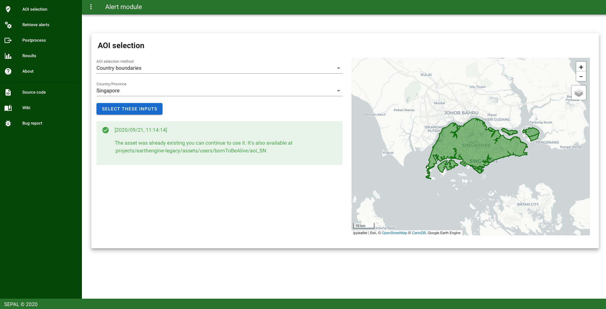
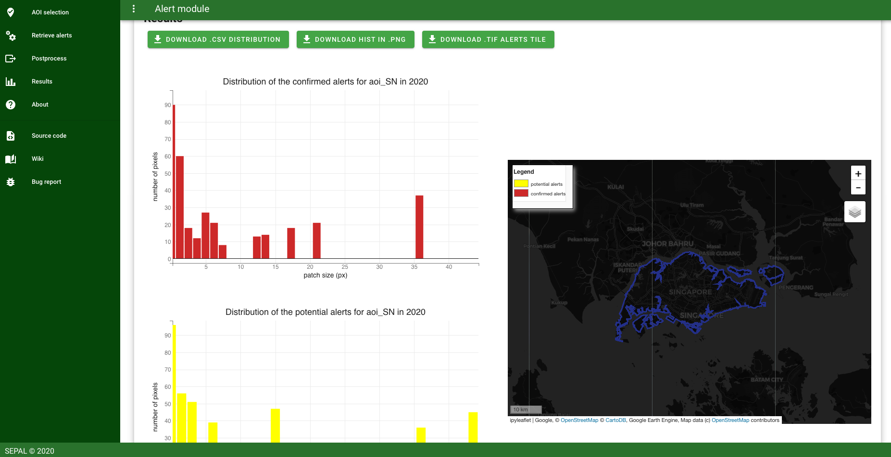

# GLAD alerts module

## about
this module is a 3 steps process that retrieve and compute the alert system on a selected Aera of interest.



## Usage

### Step 1: AOI selection
In this first step you need to select a country using one of the provided method. This inputs will be processed in the following steps.

### Step 2: Retrieve alerts

In this second step several alerts system (Glad alerts, local tif file, gee asset) will be available. Then you'll be asked to select the time range you're interested in. It will produce filtered tif file of alerts on your area of interest.
If the process have already been launched the user will be asked to continue on the third step.

### Step 3: Postprocess
After verifying that the alerts have already been filtered, launching this third cell will import the files to a ~/alert_results folder in your Sepal environment. These files will be merged to provide a single map of the alerts on the selected country, their dates and the different patches of alert. Using this map, you'll create a output file containing the surface in pixel of each patch of Glad Alert and its classification (confirmed, likely) if available. The tool provide some small visualisation of the data by diplaying the distribution of the GLAD Alert on the AOI.

### Results
The module allows you to display an histogram of the alerts patches, download the raster and a .csv file of the results



for more information about usage please read the [documentation](doc/doc.md)

## contribute
to install the project on your SEPAL account 
```
$ git clone https://github.com/12rambau/alert_module.git
```

please retreive the develop branch where all our development live
```
$ git checkout --track origin/develop
```

please follow the contributing [guidelines](CONTRIBUTING.md).


