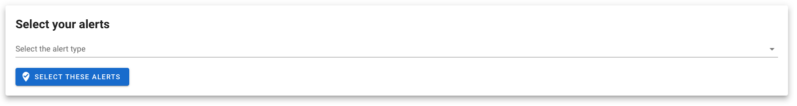
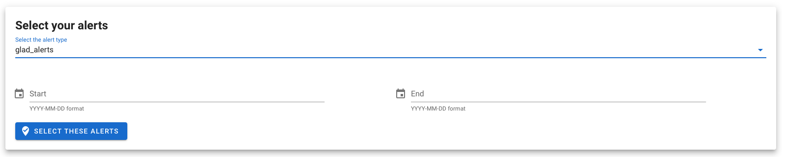
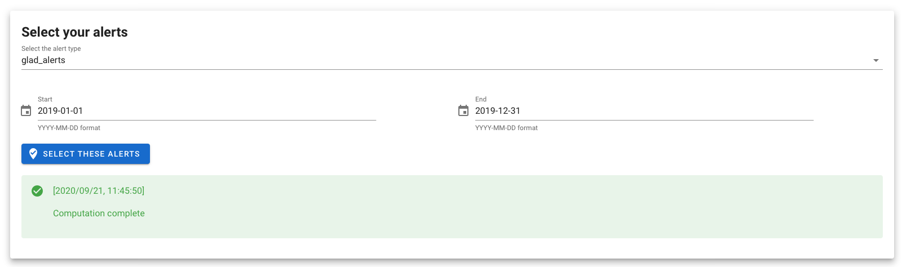
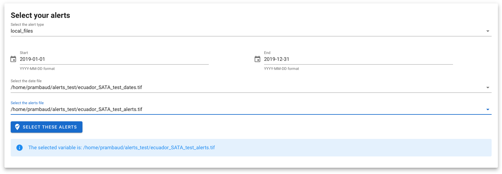
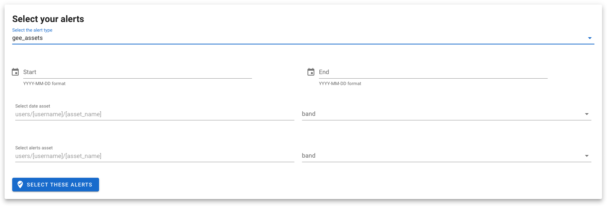

# 2. Retrieve the alerts

First you'll need to select the alert system you want to use. In the version 1.2 of the module, 3 are available and will be described in the following.

 

## GLAD alerts

### Description

This data set, created by the [GLAD](http://glad.geog.umd.edu/) (Global Land Analysis & Discovery) lab at the University of Maryland and supported by Global Forest Watch, is the first Landsat-based alert system for tree cover loss. While most existing loss alert products use 250-meter resolution MODIS imagery, these alerts have a 30-meter resolution and thus can detect loss at a much finer spatial scale. The alerts are currently operational for select countries in the Amazon, Congo Basin, and Southeast Asia, and will eventually be expanded to the rest of the humid tropics.

New Landsat 7 and 8 images are downloaded as they are posted online at USGS EROS, assessed for cloud cover or poor data quality, and compared to the three previous years of Landsat-derived metrics (including ranks, means, and regressions of red, infrared and shortwave bands, and ranks of NDVI, NBR, and NDWI). The metrics and the latest Landsat image are run through seven decision trees to calculate a median probability of forest disturbance. Pixels with probability >50% are reported as tree cover loss alerts. For more information on methodology, see the [paper in Environmental Research Letters](http://iopscience.iop.org/article/10.1088/1748-9326/11/3/034008).

Alerts remain unconfirmed until two or more out of four consecutive observations are labelled as tree cover loss. Alerts that remain unconfirmed for four consecutive observations or more than 180 days are removed from the data set. You can choose to view only confirmed alerts in the menu, though keep in mind that using only confirmed alerts misses the newest detections of tree cover loss.

### usage

Select the glad_alerts’ driver and the two dates of your time range of interest. Be aware that we cannot combine results from different years as they don't live in the same dataset. The first year published on google earth engine is 2017.

By clicking on the “run process” `button`, you will launch the process on you GEE account. In the information banner, the module will give you insights on the progression of the process. 

Once the process is completed you should obtain the following message:

 

## local alerts

If you produce a locally derived alert system and you want to use it in this module you need to save it in a format compatible with the alert driver. You'll need to create to different files: 
- the alert file : a .TIFF file with value 1 if an alert exist 0 elsewhere. You can use other value to described other type of alerts (likely etc...). Contact the contributors via the [issue panel](https://github.com/openforis/glad_alerts/issues/new/choose) if help is needed.
- The date file : a .TIFF file with the julian date of the alerts (number of days since 01/01/0001), 0 elsewhere. it will be used by the driver to filter the useful alerts. If you don't have this file and you want to consider every alerts in your alert file. duplicate it and replace all the non zero by a know date (21/09/2020 = 737689). 

Once your done, select the time range you want to study, and the two file you created.

By clicking on the “run process” `button`, you will launch the filtering of your alert system. In the information banner, the module will give you insights on the progression of the process.

 

## GEE asset alerts system

If you produce or want to use a product existing on earthengine. Use the `gee asset` driver. 
You'll require 2 assets :
- the alerts : any gee Image collection with an alert band. 1 when there is an alert 0 elsewhere 
- the alert dates : any gee ImageCollection with an date band. the julian date of the alerts (number of days since 01/01/0001), 0 elsewhere. it will be used by the driver to filter the useful alerts. If you don't have this file and you want to consider every alerts in your alert file. duplicate it and replace all the non zero by a know date (21/09/2020 = 737689). 

after selecting the file, you'll be ask to pick up the appropriate band.

> if you require to analyse more exotic alert system available on GEE (ex. with several bands to analyse) raise a ticket on the [issue panel](https://github.com/openforis/glad_alerts/issues/new/choose)

Once your done, select the time range you want to study, and the two file you created.

By clicking on the “run process” `button`, you will launch the filtering of your alert system. In the information banner, the module will give you insights on the progression of the process.

---
[ go to  &rarr; 3. Postprocess the alerts](./postprocess_alerts.md)  

[return to &larr; select an AOI](./select_aoi.md)
